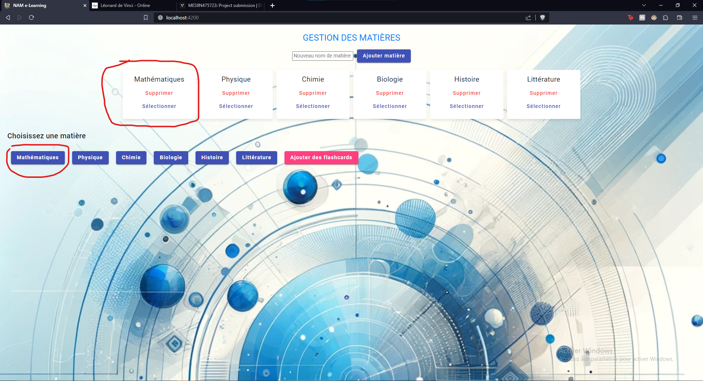
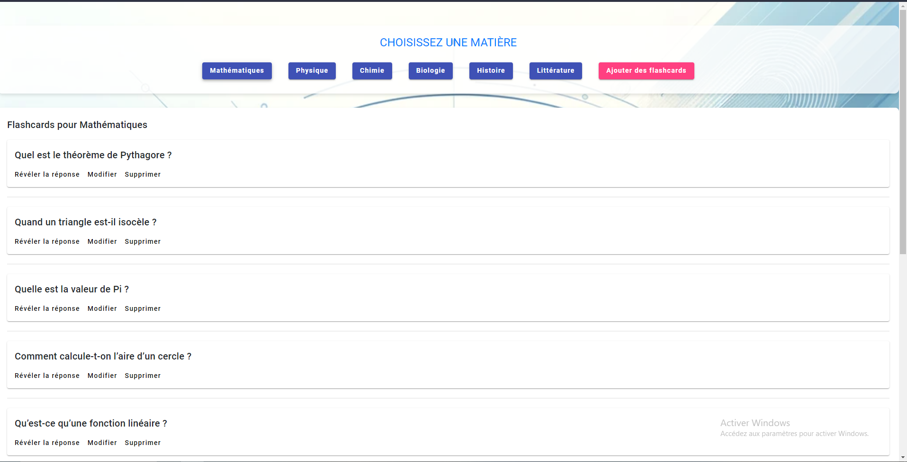
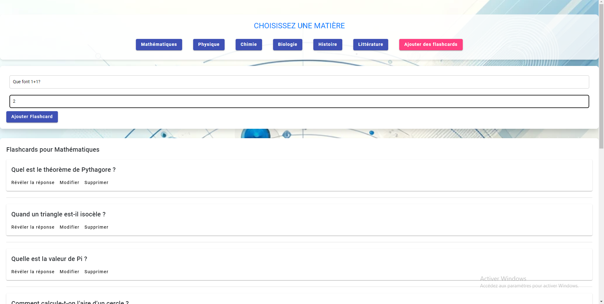
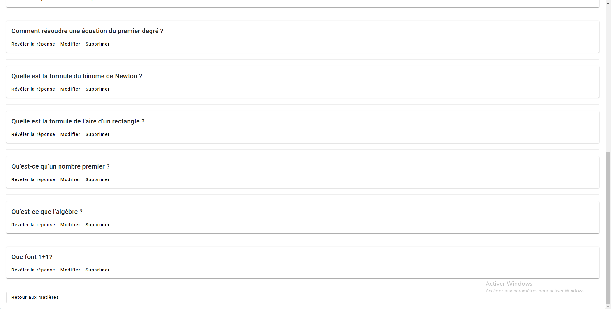
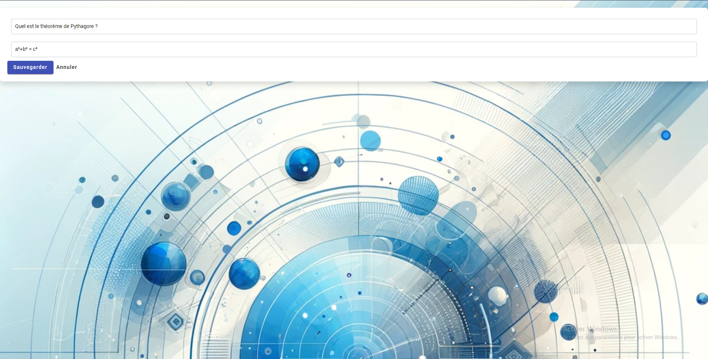
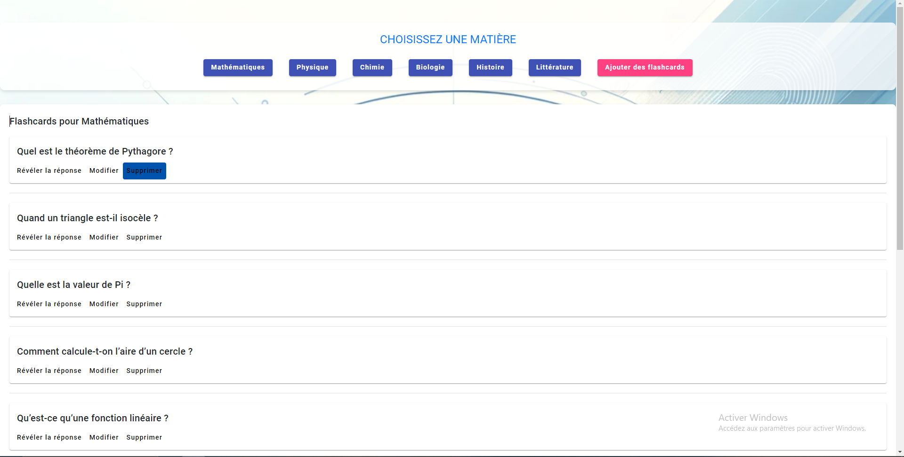
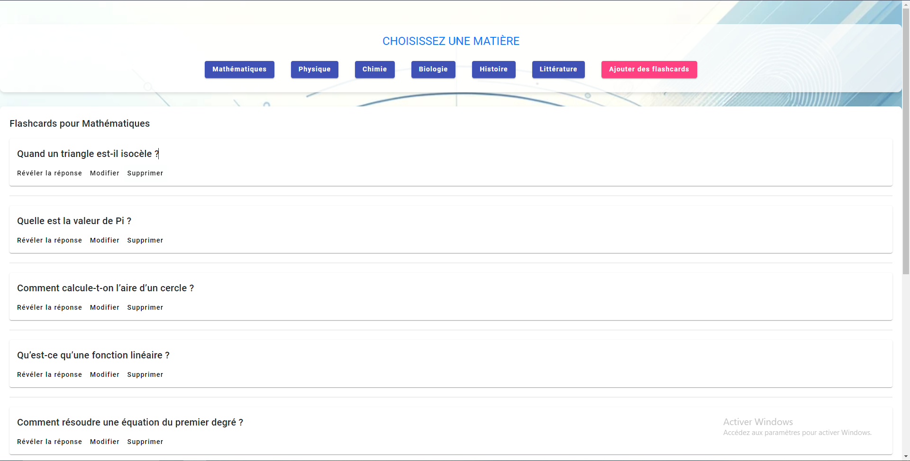

# NAM e-Learning Platform

Welcome to the NAM e-Learning Platform - a modern, intuitive, and interactive platform for online education. Our platform allows learners to engage with educational content through flashcards on various subjects.

## Features

- **Subject Selection**: Choose from a variety of subjects including Mathematics, Physics, Chemistry, Biology, History, and Literature.
- **Flashcard Interaction**: Add, edit, and delete flashcards to customize your learning experience.
- **Responsive Design**: Our platform is fully responsive, providing a seamless experience on both desktop and mobile devices.

## How to Use

### Choosing a Subject

Upon loading the application, you'll be greeted with a selection of subjects.

### Viewing Flashcards

After selecting a subject, you'll see a list of flashcards. Click on a flashcard to reveal the answer.

### Adding a Flashcard

To add a flashcard, click on the "Add Flashcards" button and fill in the question and answer fields.

### Editing a Flashcard

Click the "Edit" button on any flashcard to modify its content. Don't forget to save your changes!

### Deleting a Flashcard

If you need to remove a flashcard, simply click the "Delete" button on the card you wish to remove.

## Installation

To run this application locally:

1. Clone the repository:
git clone https://github.com/RandriaNtsoa28/Project-Node.git

2. Navigate to the project directory:
cd Project-Node/Projet

3. Install the dependencies:
npm install

4. Serve the application:
ng serve

5. Open your browser and go to `http://localhost:4200/`.

## Contributions

We welcome contributions to our project. If you have suggestions or improvements, please fork the repository and submit a pull request.

## License

This project is licensed under the MIT License - see the [LICENSE](LICENSE) file for details.
